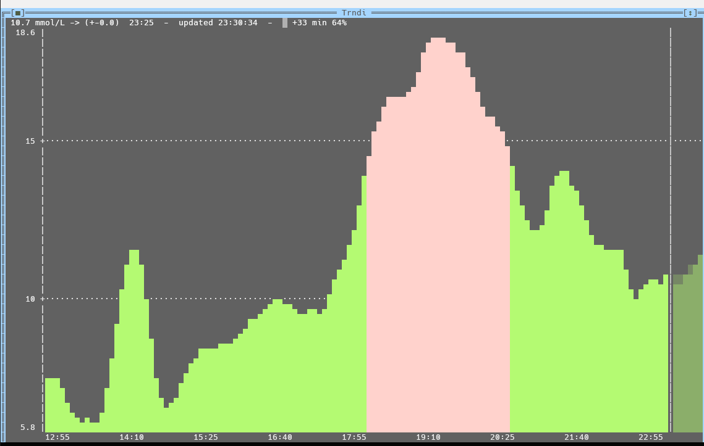
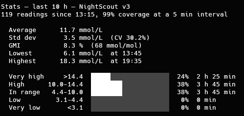

[](https://github.com/slicke/trndi-cli/actions/workflows/build.yml) [](LICENSE)

# trndi-cli - Trndi in your terminal

## Shows your CGM data in the console — one-shot or as a TUI graph

### Supports the same backends as [Trndi](https://github.com/slicke/trndi): _Nightscout - Dexcom - FreeStyle Libre - Tandem Source - CareLink - xDrip_

trndi-cli is a small GUI-dependancy-free companion to the [Trndi](https://github.com/slicke/trndi) desktop app, built on the very same API and platform layer (vendored as a submodule). If Trndi is set up on your machine, trndi-cli needs **no configuration at all** — it reads the same settings.

```
$ trndi-cli
12.9 mmol/L → (±0.0)  21:55
```

With `--graph`, a Free Vision text UI shows the last hours as a bar graph — red above your high threshold, blue below the low one, green in range — refreshed every 5 minutes:



`F5` refetches, `F9` opens the settings window and `Alt-X` leaves; the key bar sits along the bottom of the terminal.
The arrow keys walk a cursor across the bars — the header shows the exact value and time of the highlighted reading, `Home`/`End` jump to the oldest and newest — and stepping right past the newest reading (or `Esc`) returns the header to the live view. A refresh keeps the cursor on its reading.

`F6` (or starting with `--predict`) adds a half-hour forecast past a divider on the right, drawn in shade rather than solid so it never reads as measured data. It comes from Trndi's own prediction model — a robust weighted regression with a curvature term — and appears only when the fit is worth showing: a flat trend or a noisy sensor leaves it out entirely, and the header carries the horizon and the model's own confidence (`forecast ▒ +30 min 66%`). It is off by default and knows nothing about insulin or carbs, so treat it as the shape of the last half hour continued, not a plan.

With `--stats` it summarises a period instead — average, spread, GMI and the time-in-range bands, taken from the same thresholds the graph colors use:



With `--spark` the last hours become a single line — the graph's shape and colors as a sparkline, followed by the current reading — sized to fit a status bar, MOTD or prompt:

```
$ trndi-cli --spark
▃▃▄▅▅▅▅▄▄▃▃▂▂▂▁▁▁▂▃▃▃▄▅▇██████▇▇▆▆▅  7.1 mmol/L ↘ (-0.4)  20:15
```

On a terminal the glyphs are colored by the same thresholds as the graph; piped — into a status bar module, say — they come out plain, as does setting `NO_COLOR`.

## Usage

```
trndi-cli               print the current reading and exit
trndi-cli --check       ... with the range in the exit code, for scripts
trndi-cli --graph       interactive TUI graph (arrows inspect readings, F5 refresh,
                        F6 forecast, F9 settings, Alt-X exit)
trndi-cli --predict     ... with the forecast drawn from the start
trndi-cli --stats       summarise the last 24 h
trndi-cli --stats 6     ... or any window from 1 to 168 hours
trndi-cli --spark       the last 3 h as a one-line sparkline
trndi-cli --spark 8     ... or any window from 1 to 24 hours
trndi-cli --setup       settings window: backend, address, secret, unit, limits
trndi-cli --help        options
```

Exit codes: `0` OK · `1` not configured · `2` unknown backend · `3` connection failed · `4` no recent reading. `--check` adds `5` above the high threshold and `6` below the low one — the same thresholds the graph colors use — so a cron job can alarm without parsing the output:

```bash
trndi-cli --check >/dev/null; [ $? -eq 6 ] && notify-send -u critical "Low glucose"
```

## Building

Linux:

```bash
git clone --recurse-submodules https://github.com/slicke/trndi-cli
cd trndi-cli && make        # needs fpc 3.2+ with the Free Vision units
./bin/trndi-cli
```

Haiku (r1beta5 or newer):

```bash
pkgman install fpc devel:libcurl
make        # install goes to /boot/home/config/non-packaged
```

Windows (PowerShell, FPC from a [Lazarus](https://www.lazarus-ide.org/) install found automatically):

```powershell
.\make.ps1
```

Running on Windows needs `libcurl.dll` ([curl.se/windows](https://curl.se/windows/), rename `libcurl-x64.dll`) next to the exe or in `PATH`.

Every green build on `main` publishes binaries for Linux (x86-64, ARM64 and i686), FreeBSD, Haiku and Windows under [Releases](https://github.com/slicke/trndi-cli/releases).

`sudo make install` puts the binary in `/usr/local/bin` together with tab completion for bash, zsh and fish (`PREFIX`/`DESTDIR` respected for packagers). The completions also work on their own: `make install-completions`, or source `completions/trndi-cli.bash` from your `.bashrc`.

## Configuration

Configured Trndi GUI = done. Without the GUI, `--setup` opens a settings window in the same Free Vision style as the graph — backend, address, secret and unit, with a Test button that connects before you save. `F9` opens the same window from graph mode.

```
╔═[■]═════════════════════ Trndi settings ═════════════════════════╗
║   Backend                        Address / account               ║
║   NightScout                ▲    https://my.nightscout.site      ║
║   NightScout v3             ■                                    ║
║   Dexcom (USA)              ▒    Secret / password               ║
║   Dexcom (Outside USA)      ▒                                    ║
║   Dexcom New (USA)          ▒    Stored - type to replace        ║
║   Dexcom New (Outside USA)  ▒    Unit                            ║
║   Dexcom New (Japan)        ▒    (*) mmol/L                      ║
║   Tandem t:connect (USA)    ▼    ( ) mg/dL                       ║
║                                                                  ║
║  Address: the Nightscout site URL. Secret: API secret or access  ║
║   token.                                                         ║
║  Saved in /home/you/.config/Trndi.cfg                            ║
║                                                                  ║
║                                 OK      ►  Test  ◄    Cancel     ║
║                                                                  ║
╚══════════════════════════════════════════════════════════════════╝
```

The stored secret is never loaded into its field: leaving it empty keeps it, and what you type is masked. It writes exactly what the GUI reads, in the place the GUI reads it, so the two stay interchangeable. The values can also be set by hand — see the [manual](MANUAL.md).

## License

GPLv3, like Trndi — see [LICENSE](LICENSE).

> ⚠️ **Medical disclaimer**: trndi-cli is NOT a medical device. Data may be delayed, inaccurate or unavailable. Never make medical decisions based on this software — verify with official devices.
